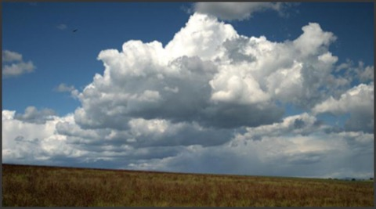

# Treat experiences as dreams
(2)

This slogan is about loosening the tight grasp of expectations we impose on reality. It encourages us to percive reality in a new way. To notice its constant changing.

Try this exercise. Relax in a comfortable position. Focus on your breath. Cover your breath with your attention. Now follow a thought from the moment of its first appearance to the moment of its disappearance. I think what you'll notice that you can not see the arising and falling away of a thought. You can not know what you will think next nor when it will fade until it has already faded away. They are fragile and ephemeral - dream-like.

Everything appears in the cloud of consciousness. All your feelings and your sensations. Your thought-streams and your mood-streams. Your desires and your plans. Your self-talk and your dreaming. They all are just appearances in consciousness. Always changing in character, never still, always plastic.

You are dancing in the playful dream-like unfolding of reality and morphing constantly, one way then another. When you stop and look closely, you can catch a glimpse of this dance.

In the Diamond Sutra, the Buddha taught about the dream like nature of experience:

> "All conditioned dharmas (experiences) are like a dream, like an illusion, like a bubble, like a shadow, like a dewdrop, like a lightning flash; you should contemplate them thus."

The fleeting impermanence nature of sights, sounds, smells, flavors, sensations of touch, and thoughts is what is meant by "like a dream, like an illusion".

See everything as a dream - lighten up your grasp on certainty. Notice things ephemeral qualities and your mistaken notions associated with what you take to be real. Your experiences have 'a fragile presence that vanishes the very moment it comes into existence.'[^Aeberhard:2017a] Grasping at these dreamy illusion is a way you create the causes of misery, dissatisfaction, and suffering.

You are blind to your biases and fail to appreciate how 'dream-like' your existence is. Being absorbed in this 'dream-like' state and not knowing you are dreaming, is a cause for suffering. The antidote is to see everything for what it is. See things in their natural dream state. Sights, sounds, smells, flavors, sensations of touch, and thoughts not unchanging. When you stop, breath and look closely at your mindstream amidst the busyness of your life, your mindstream will become more transparent - this will loosen your certainty and open your eyes to just how dreamy life is. But the first step is to "Treat experiences as dreams."

But most of the time, you are buffed about by your' mind weather'. You become acclimatized to your ego narrating your life. It would be one thing if this narration was loving and an accurate reflection but its not. 

Be simple. Act ordinarily. Strive for ordinariness.

One way to see the dream-like quality of experiences is to look closely at the beginning and end of each sensation or thought. Try and notice the first moment of an impression. Stay with it as it morphs and ends. Notice the rising and falling away of the feelings. Notice how it changes as quickly as it arrises.

The whole process a sensation or thought goes through from beginning to end reveals its dreamy nature under the watch of consciousness. This is missed when we are on autopilot, feeling without knowing we are feeling, thinking without knowing we are thinking.

During the busyness of the day, stop and remember this slogan. If only for a few seconds, when transitioning from one activity to another, see if you can muster a sense of the dream-like quality of your experience.

- Ask yourself, "What is it behind all this discursive thought?"
- Become unstuck from the fantasy world where the mind keeps talking to itself.
- Work to be more open and relax into the shifting nature of life.
- This slogan doesn't say that dreams don't matter. They are the fabric of your life.

    "Listen closely...
    the eternal hush of silence
    goes on and on throughout all this,
    and has been going on,
    and will go on and on.
    This is because the world
    is nothing but a dream
    and is just thought of
    and the everlasting eternity
    pays no attention to it."

        Jack Kerouac (1922 - 1969)

[^Aeberhard:2017a]: Simon Aeberhard (2017): _Writing the Ephemeral. John Cage's Lecture on Nothing as a Landmark in Media History_, 2017, Journal of Sonic Studies, Vol. 13.

----------------------------------------------------------------

Different mind set ...............................................[[201904201424]]
Don't get trapped by emptiness ...................................[[201903030457]]
In the intervals be a conjurer of illusions ......................[[201903050446]]
Time To Exhale .................................................[[202011220805]]

## Alternate Titles
- See everything as a dream
- Train to view all phenomena as dreamlike
- Regard all dharmas as dreams
- Regard all phenomena as dreams
- Consider the world as dreamlike
- Consider all phenomena as a dream

----------------------------------------------------------------
03-01-2019 - 5:55 AM
›[[201903010555]]
→ #slogans

