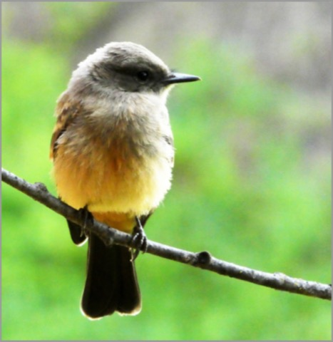

# Examine the nature of awareness 
(3)

This is a continuation of the theme of looking at mind and reality.

This slogan is encouraging you to examine and investigate, look within yourself, look for yourself, look for a definite, concrete, unchanging, identifiable somebody. Look and don't speculate. Ask yourself 'Where is this thing I call me?', 'Who is it that is watching this dream?' 'What is really going on here?'. Look at the looking itself. Become interested in the unfolding of your experiences. 

Turn your attention to attention itself, to the feeling tone of the paying attention to your experiences. The character of thinking, feeling, and perceiving is like a stream. They are always changing. Flowing into and out of view briefly. They move from prior causes to extinction. They are shaped by a self-grasping ego often non-reflective of the reality of a situation. 

This slogan is asking you to examine your first-person experience. Subjectively, what is your mind like. What does your experience of perceiving and feeling processes feel like? 

Examine your mind as a way of approaching nature. Your mind is a continuum of moments. [^@Rinpoche:2009a]

Most of your life is sent caught up within the drama of activity. You have to take opportunities to wake up from the automaticity of thinking, feeling, and perceiving and examine the character of the thought, feeling, and perceiving.

To halt the automaticity, practice returning from being captured by thoughts. Notice that you are thinking. In that very act, you become mindful of your present moment experience. At first, this will be only a momentary awareness of your release from your usual automaticity. Like training a puppy, at first reward for small gains. Train consistently with more distractions in more varied environments as the behavior becomes more established.  

Look at your sense of consciousness directly with dispassionate, inquisitive observation.

What and who is this self? When you look, you can not find anything. Yet this feeling of an "I" is so vivid. Practice such that you become curious about the whole process of looking for a self and seeing what you discover. This training can be done at any time, anywhere.

Is your ego running your life on autopilot? Don't let days go by on autopilot, thinking without noticing your thinking, feeling sensations without being aware of the particulars of those sensations.

You will find, if only briefly at first, that you are not your labels, your emotional states, your thoughts. Dropping into this awareness allows clear seeing. Once you can experience this clear seeing, relax your mind and maintain this for as long as it persists. Then start again, as if for the first time. 

----------------------------------------------------------------

Find freedom through investigation and close analysis ..........[[201904230512]]
Don't get trapped by emptiness .................................[[201903030457]]
Let confusion awaken and practice emptiness ....................[[201903130526]]
• Ten Billion Moments ..........................................[[202009100728]]

## Alternate Titles
- Examine the nature of awareness
- Examine the nature of the unborn awareness
- Examine the nature of unborn awareness
- Investigate the nature of unborn awareness
- Analyze the unborn nature of mind

----------------------------------------------------------------
03-02-2019 - 5:14 AM
›[[201903020514]]
→ #slogans

