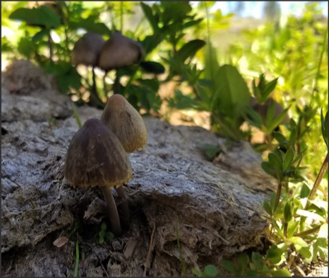

# 3 Objects, 3 Poisons, 3 Seeds of Virtue 
(8)
 
Objects
    1. People and things we're attracted to
    2. People and things we're repelled by 
    3. People and things we're indifferent to
Poisons
    1. Attachments, passion, greed
    2. Aversions, aggression, hatred 
    3. Ignorances, delusion, indifference
Virtues (seeds of happiness)
    1. Non-attachment
    2. Non-aversion
    3. Love
 
This slogan encourages noticing when any of the three types of objects arise. Notice your natural tendency to fall into the corresponding poisons. Switch things up and transform then into seeds of happiness. This is a beautiful actionable plan.

How you label your experience of the people and things you encounter color life brightly or dully or with joy or with pain. Not all labeling is negative. Labeling something hot or sharp will keep you safe. Your labels get way off base when confusing self-referential ego-grasping for the way things naturally are. Don't allow fears, assumptions, and biases to control how you label the three objects.

“For Zen students, a weed is a treasure,” said Shunryu Suzuki. Use the objects and the poisons to cultivate the virtues. In a sense, be thankful for the poisons in your life as they are teaching you, are your guides. 

> The Stoics taught this as "The Obstacle is the Way." 

The effect of labeling your experience is an underlying theme in this slogan. Labels come from our encounters with and around people and then are projected onto the person. We are continually making judgments about people, your experiences, and our labels. "This is good," "This is bad." "This is a friend." "This is an enemy."

Zen students are taught that with a quiet mind, you can except the reality of your situation and be satisfied with it. Still, as soon as you elaborate, label, and fall into discursive thought, you've freed the monkey mind to go to work with its own agenda. 

The work of changing your labels, and working towards not having them, is a process of first noticing the labeling. Seeing which poisons are activated and then countering with the corresponding virtue. Changing your mind is hard work once a label has been formed. Not forming them in the first place is easier than dealing with them once they have arisen. 

Much of our labeling is a natural tendency to try and keep hold of things you desire and completely rid yourself of what you don't want. 

Poisons arise not from the object directly. Poisons arise from our labeling. This is common in most wisdom traditions. 

> “Men are disturbed, not by things, but by the principles and notions which they form concerning things.” - Epictetus[^1]

Start by meditating on a person you like, breathe in their delusion and pain, and then transform it breathing out love and non-ignorance. As you gain stability meditating using people you like as the object, you can move on to people you are indifferent towards and people you are repelled by.
 
Whenever attraction, aversion, or indifference arises in you, breathe in the pain and confusion and breathe out love transforming the three poisons into seeds of virtue. Practice, improving a little at a time.

Pay attention to labeling and notice how sticky such labels are. When you react, see what you are responding to and where you place the blame.

This all has too much structure and not enough emptiness from a Zen perspective. Keep a "don't know mind" and give it a try and see.

[^1]: Epictetus and George Long (1991): _Enchiridion_, Amherst, N.Y.: Prometheus Books [@Epictetus:1991aa]

----------------------------------------------------------------

Don’t poison yourself ..........................................[[201903280559]]
Drive all blame into a single source ...........................[[201903110656]]
Cultivate a serious attitude ...................................[[201903160423]]
Keep the three inseparable .....................................[[201904150459]]

## Alternate Titles
- Turn things around 
- Three objects, three poisons, and three seeds of virtue
- There are three objects, three poisons, and three roots of virtue
- There are three objects, three poisons, and three sources of virtue
- Your problems are your gifts

----------------------------------------------------------------
03-07-2019 - 5:39 AM
›[[201903080539]]
→ #slogans

