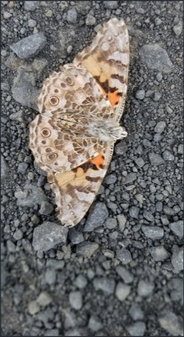

# Drive all blame into a single source 
(12)
The original slogan is: "Drive all blames into one."

The single source, in this case, is the self-centeredness and the grasping ego.

Self-centeredness leads to blaming your troubles on others. Don't blame others for your suffering. This slogan says, turn this around and take on the blame yourself. It is your life, and you are responsible. Your sense of selfhood, of being a separate self, holds you back from a flourishing life. 

Zenists would say, "Eat the blame." There is a story about a cook and a Zen Master, who finds the head of a snake in his 'vegetarian' soup during a formal meal served in the meditation hall. The cook quickly approaches the Zen Master and grabs the snakehead and eats it. Eating the blame.

Self-centeredness and the grasping ego are the reasons for all problems and disturbances. Self-centeredness and grasping are tools of the ego. They obfuscate responsibility, putting blame anywhere but where it really belongs. Stop ego grasping, and problems fade away. More self-centeredness equals more problems. It is easier to stop grasping with ego than it is to work and struggle to fix problems. Stop grasping at the ego is the ultimate fix. The perfect fix. The superior fix. 

Self-centered ego comes from the feeling that you are most important. Looking for someone else to blame. All suffering in the world comes from this self-centeredness and the grasping ego. See your own egoistic mind as the cause of all your suffering.

It takes courage to look deeply at blame. Look at every detail. Consider that there is really no one to blame, and the mind is grasping at trying to make it into a self. The mind wants to hold itself up in contrast to everything else. To be separate in the world. Your mind wants to point blame outward and create division. It is this blaming and division that needs purging. 

Blaming others is a way the mind avoids taking responsibility for its part in the situation of blame. In some circumstances, you may be an innocent bystander, but as an antidote to your self-centered ego, accept responsibility for how you react. It's not helpful but piling-on and compounding the suffering. Blame is the root of a self-cherishing attitude. At the very least, it is a dumb hobby. 

When you get caught in situations and act out of fear, anger, confusion, and ego, the antidote is to breathe to open awareness. There are two modes of operation that help - aspiration and action. When you have the power of presence that is centered on being present, giving, connecting, you can empower yourself for action in a healthy way. Sometimes situations are too energetically charged for you to have this power of presence. Rather than getting caught in the tsunami, you can breathe it in. Choosing to begin again to aspire to connect with the moment. You don't have to have answers, you don't have to make some dramatic action. You can hold an aspiration until you can develop the ingredients for action. 

> "Because you will have realized that because you are alive and not dead, because you have a human body and not some other kind of a body, because the world is a physical world and not an ethereal world, and because all of us together as people are the way you are, bad things are going to happen. It’s the most natural, the most normal, the most inevitable thing in the world. It is not a mistake, and it isn’t anyone’s fault. And you can make use of it to drive your gratitude and your compassion deeper." - Norman Fischer

----------------------------------------------------------------

3 Objects, 3 Poisons, 3 Seeds of Virtue ........................[[201903070509]]
Use misfortune as practice .....................................[[201903100511]]
Observe, no matter what ........................................[[201904110510]]
Don’t poison yourself ..........................................[[201903280559]]
Be grateful to everyone ........................................[[201903120542]]
There is only one point of focus ...............................[[201903180624]]
Don't make a public display of your efforts ....................[[201903230512]]
Meditate on your dissatisfactions ..............................[[201904170606]]
The Power Of Regret ............................................[[202009070839]]

## Alternate Titles

- Drive all blames into one
- Banish all blames to the single source
- Blame everything on one thing
- Banish the one object of every blame
- Lay the blame for everything on one
- Be present and drop ego-clinging
- Hold one fault accountable for all misfortunes
- Take responsibility

----------------------------------------------------------------
03-11-2019 - 6:56 AM
›[[201903110656]]
→ #slogans

	

