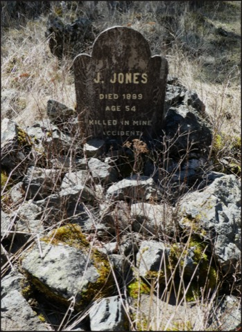

# Practice for death as well as for life
(18)

These are instructions on how to have lived a life you can be happy with when you die. Don't waste this precious opportunity.

You don't know if you'll die in the clothes you put on this morning. Practice the five powers or strengths your whole life, especially in preparation for death. Start before it is too late. Practice for your coming death as well as for your life. Life and death are part of the same continuum. How you are, the thoughts you have, the habits you have developed are how you are living, they also prepare you for how you will die. How you think about death, how you are impermanent, colors your thoughts, and the habits you develop. In this feedback loop, how you feel about death directly affects the quality of your life and how you live your life, in turn, affects what will happen at your death.

The original slogan, "The Mahayana instruction for the ejection of consciousness at death is the five strengths: how you conduct yourself is important."

Having an accurate perception of your impending death helps motivate you to be the best person you can. This is hard when you are young but gets easier as one progresses towards the inevitable and sees the different gravities of life happen to those you love. Time is a teacher. Whether you are consciously aware of your impending death or hide from it and deny it, it influences your behaviors. Which would you rather have: an abundant life, filled with love, and poignant or a life filled with fear and denial about reality?

Breath in confusion, breath out relief. Do this all the way till death. Do not wait until it is too late.

The five strengths in the previous Slogan 17 are restated here in the context of your approaching death. They provide guides on how to train the mind and face your coming death in a bright, open, and compassionate way.

Live intentionally, with purpose. Don't sail away with the winds of what is popular at the moment. Use the five strengths to wake up to your life and your death.

French writer Charles Péguy wrote, "A person doesn't die from this or that disease. He dies from his whole life." This is an encouragement to practice now.

----------------------------------------------------------------

Proficiency comes when practicing even when distracted  ........[[201903210523]]
Be consistent in your practice .................................[[201904210547]]

## Alternate Titles
- Practice for death as well as for life
- Don’t waste your life
- The Mahayana instruction for ejection of consciousness at death is the five strengths: how you conduct yourself is important
- As Mahayana’s transference method is the five powers alone, their practice is vital.
- The instructions for the Great Vehicle transmigration of consciousness is to apply those vary five forces lying in the perfect position.

----------------------------------------------------------------
03-17-2019 - 4:57 AM
›[[201903170457]]
→ #quote, #slogans

