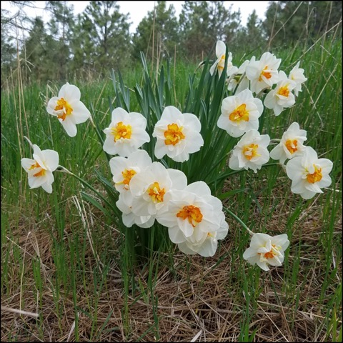

# Don’t poison yourself 
(29)

This slogan is not about dietary restrictions. It is about holding on to the self, about how we feed the ego about watching out for what is nourishing and what is not. The poisons cover food, drink, thoughts, emotions, and even spiritual practices.  

'Wholesome deeds performed with selfish aims are just like poisoned food.' How you feed your motivation is very important. Watch for the appearance of poison creeping into your motivation. You can become poisoned before you realize it. Shore yourself up with the antidote of practice. Having self-grasping ignorance and the self-cherishing attitude comes naturally through the process of living life. Instead of following these habits, say, "No, thank you, I don't eat that stuff anymore; I know it's bad for me. It holds me captive."

Watch not to poison our motivation. 

Poisons - **Never fail to perceive these as the real enemy.**

* Self-grasping ignorance
* Self-cherishing attitude
* Feeling superior to others
* Self-centeredness
* Defeatist self talk
* Self interest
* Selfishness
* Inconsiderateness 
* Self Worry
* Pride
* Ego-fixation
* An identity formed around practice.

----------------------------------------------------------------

There is only one point of focus ...............................[[201903180624]]
Don't make a public display of your efforts ....................[[201903230512]]
Don't expect results ...........................................[[201903270458]]
3 Objects, 3 Poisons, 3 Seeds of Virtue ........................[[201903070509]]
Drive all blame into a single source ...........................[[201903110656]]
Cultivate a serious attitude ...................................[[201903160423]]
Don’t unload on everyone .......................................[[201904020523]]

## Alternate Titles

- Don’t poison yourself
- Discard poisonous food
- Abandon poisonous food
- Give up poisonous food

----------------------------------------------------------------
03-28-2019 - 5:59 AM
›[[201903280559]]
→ #slogans
Tale of two wolves .............................................[[201903280628]]
 

