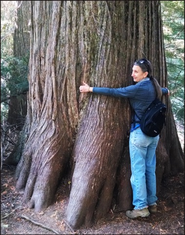

# Be patient either way 
(42)
#inbox 

No matter what circumstances you find yourself in, good or bad, be patient. "Either way" points to practicing patience, to being still. Patience with equanimity. See all these circumstances as transient. Watch the good ones fall apart and treat the bad ones are opportunities. 

You tend to attach to things that will _fall apart_ (all the impermanent situations of life) and try to distance yourself from life's _opportunities_ (the circumstances you consider bad.) Always be patient because when things _fall apart, opportunities_ will arise and visa-versa. These are the constant fluctuations of cyclic existence. 

When things _ fall apart_, and _opportunities_ present themselves, it is not because you made a mistake. It is just the flow of life. You have no control over things outside your mind. That is how life is, it is a long series of changes, and each time life changes, your circumstances change. You do not have any control over this, so the best thing to do is relax and be patient.

Wait with humble equanimity for whatever happens, rather good or bad. Except it for what that is. Patience is the ballast for the vessel that is your life. Stay focused on your practice. 

It is hard to be undistracted and practice steadily. You lose your bearings from time to time. You might lose track of your practice. Don't let your practice be swayed by the current situation's tenor, no matter how good or bad it is. Situations unfold at their speed. When you are impatient, you closed off the flow of life. Being closed off to life is why you need to do mind training practice. You can't wait for the time when everything is in alignment to practice. It would be best if you practice now.

'There is a Zen story about a man whose horse ran away. People said it was bad luck. Then the horse came back, which people thought was good luck, and then his son broke his leg while falling off it, and people thought that was bad luck come round again. But because he broke his leg, the man's son was saved from being drafted into the army and dying in a war, and the cycle went on and on.'

Be patient either way, and things will change. Endure whichever situation arises, good or bad. Things change. Good turns bad, and bad turns good. "We'll see" is the operative mood here. In the meantime, focus on recognizing the awake state. 

----------------------------------------------------------------

Proficiency comes when practicing even when distracted  ........[[201903210523]]
Every encounter suddenly becomes the path ......................[[201903150533]]
Be true to the principled one ..................................[[201903190550]]
Train without bias .............................................[[201904160516]]
Too Soon To Say .................................................[[202009211958]]

## Alternate Titles
- Whichever of the two occurs, be patient
- Whichever of the two arises, be patient
- Be patient with whichever of the two arises
- Whichever of the opposites occurs, be patient
- Bear whichever the two occurs
- Don't judge your practice on external circumstances

----------------------------------------------------------------
04-10-2019 - 5:07 AM
›[[201904100507]]
→ #slogans

