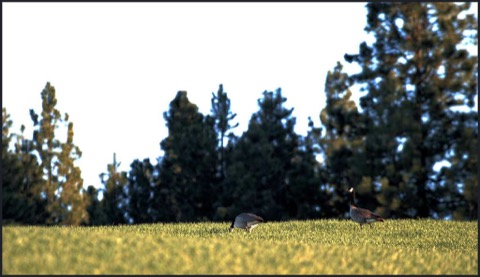

# Face the three challenges 
(44)

The first challenge is being aware enough to notice negative emotions arising. The second challenge is overcoming those negative emotions once they have arisen and then to get some separation between the automaticity of habitual energies and the intention to release self-cherishing ego. The third challenge is the eradication of negative emotions so they don’t return.
 
In short; notice, stop, breath and return. 

The three challenges:
 
1. Negative habitual impulses arise so quickly they are hard to catch. Acknowledge to yourself when caught by habitual impulses. Recognize neurosis. It take practice and concentration otherwise the arising of emotions escape your attention.
2. Once identified it is hard to know what to do and not stumble and fallow the arising negative habitual pattern. Choose to do something different than what hasn't worked in the past. Apply antidote.
3. Keep a vigilance for the next time and determine not to follow habitual impulses.

"The first difficulty is when the habitual impulse first appears in your mind, the moment when it first pops up. Can you notice it? The second difficulty is the once it appears, it is compelling and very difficult to let go of. Can you let go? The third difficulty is the even if you can let go, it is hard not to be compelled by it all over again when it pops up again next time because of the force of the residual habit energy that you’ve been putting into it all of this time. Can you let go again and again, with patience?" [^@Fischer:2013aa]

[^@Fischer:2013aa]: Norman Fischer (2013): _Training in compassion: Zen teachings on the practice of Lojong_, Penguin Random House Publisher Services - @Fischer:2013aa

----------------------------------------------------------------

Don’t unload on everyone .......................................[[201904020523]]
Observe, no matter what ........................................[[201904110510]]
Practice sympathetic joy .......................................[[201904250633]]
Find freedom through investigation and close analysis ..........[[201904230512]]
º Most People ..................................................[[202010272035]]

## Alternate Titles
- Train in the three difficulties
- Learn the Three Difficult Points
- Train in Three Hard Disciplines
- Practice the three hardships

----------------------------------------------------------------
04-12-2019 - 5:30 AM
›[[201904120530]]
→ #slogans

