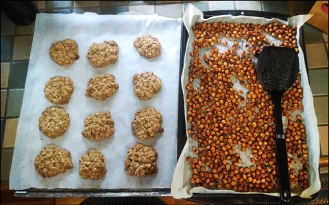

# Be wholehearted 
(54)

Train with your spiritual life, train with your daily activities. Train with your private life, train with your public life. Train with your close relationships, train with your casual relationships. Train with activities you like and train with activities that you don't like. Train with easy things, train with hard things. Practicing this way with contrasting aspects of life brings the heart-mind into awareness. Be completely saturated with this one concern, the concern of bringing the heart-mind into awareness. "When you encounter good conditions, breathe out and send them off to others. It is as simple as that." [^@Rinpoche:2009a]

Don't hold back. Don't just go through the motions of Mind Training, let this practice permeate the activities of your life. Don't give yourself a refuge where you don't practice. Keep the pressure on. 

Moment after moment, live wholeheartedly, and then let yourself die wholeheartedly.

"Among all the lives that you have had, this one is the most important be- 
cause you have obtained a precious human birth. Therefore, you should make 
it meaningful." [^@Rinpoche:2009a]

[^@Rinpoche:2009a]: Shamar Rinpoché and Lara Braistein (2009): _The path to awakening: a commentary on Ja Chekawa Yeshe Dorje's : seven points of mind training_, Delhi: Motilal Banarsidass Publishers,  - @Rinpoche:2009a

----------------------------------------------------------------

Right now exert yourself, get it right .........................[[201904190458]]
Rest in the openness of mind ...................................[[201903040448]]
Be consistent in your practice .................................[[201904210547]]
Keep the three inseparable .....................................[[201904150459]]
Train without bias .............................................[[201904160516]]
Be modest and unassuming .......................................[[201904240458]]

## Alternate Titles
- Be wholehearted
- Train wholeheartedly
- Train with decisiveness
- Practice decisively
- Do not underestimate your ability
- Be zealous in your training
- From now on, practice is the chief priority
- Train uninterruptedly

----------------------------------------------------------------
04-22-2019 - 4:48 AM
›[[201904220448]]
→ #slogans

