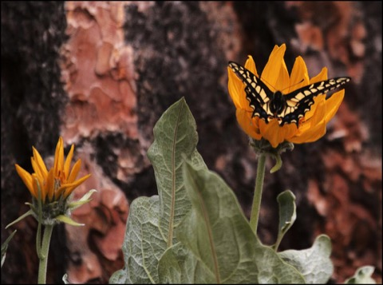

# Be modest and unassuming
(56)

Don’t be fussy, boast or wallow with your experiences. These are distractions and energy vortexes. They take a lot of mental energy to maintain. Don't make a fuss. Don't wallow. this would be gloating. Both fussing and gloating try to solidify the past rather than be free in the present. These bolster the sense of a separate self.

You are not the center of the universe. Life is for the help of others and not for the collection of rewards. It is challenging and hard work to be practicing Mind Training, to practice compassion, to develop loving-kindness, but why would you expect otherwise? 

Everyone has events going on in their lives unseen. Seeing this condition of hidden drama is what it means to be awake to the facts our relationships. Sometimes you are skillfully at handling these events and sometimes not so much. Even a non-skillful person can have surprising insights and a mature person can stumble. We each are on this path, no exception. This is a way into a compassionate outlook on life. Don't wallow in your momentary successes. https://www.dictionaryofobscuresorrows.com/post/23536922667/sonder

"Don't make a big fuss even when you are kind to another person, because you are, in fact, just working at regarding others as more important than yourself."  [^@Kongtrul:1987a]

Once again the way out of all this fussiness is to focus on the other and not the self so much. Be mature and stick to your practice of putting others first.

[^@Kongtrul:1987a]: Jamgon Kongtrul and Kenneth J McLeod (1987): _The Great Path of Awakening: An easily accessible introduction for ordinary people : A commentary on the Mahayana teaching of the Seven Points of Mind Training_, Boston: Shambhala - @Kongtrul:1987a

----------------------------------------------------------------

Practice sympathetic joy .......................................[[201904250633]]
Find freedom through investigation and close analysis ..........[[201904230512]]
Be wholehearted ................................................[[201904220448]]

## Alternate Titles
- Don't boast
- Don’t wallow
- Don’t wallow in self-pity
- Do not boast of your good deeds
- Don't make a fuss
- Do not be boastful 
- Don't take what you do too seriously
- Do not seek recognition

----------------------------------------------------------------
04-24-2019 - 4:58 AM
›[[201904240458]]
→ #slogans

